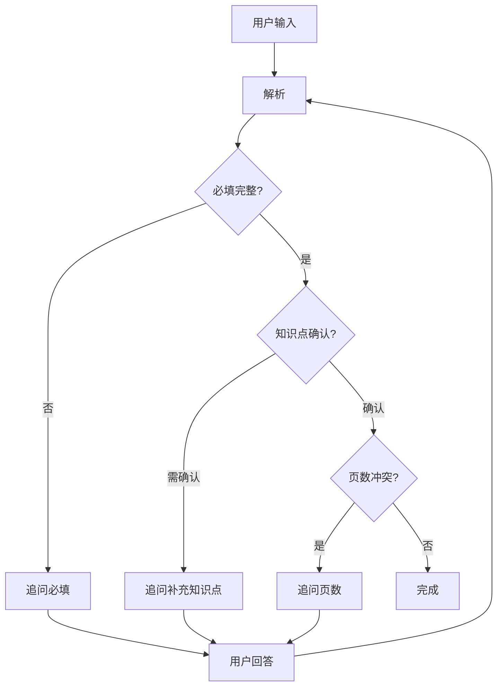

# 模块 3.1 意图理解优化方案

## 目标
建立多轮人机交互机制，基于真实PPT结构研究优化页数计算。

---

## 一、PPT结构研究结果

> 基于 30 份精品PPT分析

### 1.1 统计数据

| 指标 | 数值 |
|---|---|
| 平均页数 | 19.1 |
| 中位数 | 18 |
| 最小值 | 6 |
| 最大值 | 35 |

### 1.2 按专业领域

| 领域 | 平均页数 | 范围 | 特点 |
|---|---|---|---|
| 理科(数学/几何) | 10 | 6-14 | 公式推导为主，页数较少 |
| 护理/医学 | 14-17 | - | 流程步骤为主 |
| 机械/电气/电子 | 13-20 | - | 参数+图纸 |
| 土木/桥梁 | 23-31 | - | 工程案例详细 |
| 思政/语文 | 24-26 | - | 内容丰富 |
| 商科(电商) | 15 | - | 数据图表 |

### 1.3 典型页面结构

| 组成 | 页数 | 说明 |
|---|---|---|
| 封面 | 1 | 标题+授课信息 |
| 目录/团队介绍 | 1-2 | 大纲导航 |
| 学习目标 | 1 | 知识/能力/素养目标 |
| **知识点讲解** | **3-5页/知识点** | 核心内容区 |
| 总结/思考题 | 2 | 回顾+习题 |

---

## 二、页数计算规则（研究版）

### 2.1 基础公式

```
最小页数 = 5 + (知识点数量 × 3)
推荐页数 = 5 + (知识点数量 × 4)
```

### 2.2 习题页数

```
若 知识点 ≤ 1:
  习题页数 = LLM评估 或 询问用户
若 知识点 > 1:
  习题页数 = ceil(知识点数量 / 2)
```

> [!NOTE]
> 习题页数由 LLM 评估或直接询问用户"每个知识点安排几道习题"

### 2.3 专业修正系数

| 专业类别 | 系数 | 说明 |
|---|---|---|
| 理科类 | 0.8 | 公式推导，页数偏少 |
| 医护类 | 1.0 | 标准 |
| 工科类 | 1.0 | 标准 |
| 土木/桥梁 | 1.3 | 工程案例需详细 |
| 思政/语文 | 1.2 | 内容丰富 |

---

## 三、专业领域分类

| 类别 | 专业 | 风格 |
|---|---|---|
| 工科/工程 | 机械、电气、汽修、数控、建筑 | 参数+图纸 |
| 医学/护理 | 护理、医学、药学、康复 | 流程+安全 |
| 农林类 | 农业、林业、园艺、畜牧 | 生态图 |
| 人文艺术 | 设计、艺术、文学、教育 | 留白美学 |
| 商科类 | 会计、电商、金融、物流 | 数据看板 |
| 理科类 | 数学、物理、化学、计算机 | 公式推导 |
| 土木桥梁 | 土木、桥梁、施工 | 工程详图 |

---

## 四、多轮交互流程



---

## 五、可选字段默认值

> 系统会告知用户："如未说明，按以下默认配置"

| 字段 | 默认值 |
|---|---|
| 课时 | 45分钟 |
| 案例 | **true** |
| 习题 | **true** |
| 互动 | **true** |

---

## 六、实施文件

| 文件 | 修改内容 |
|---|---|
| `schemas.py` | 添加专业领域枚举 |
| `intent.py` | 添加页数计算+专业识别 |
| `workflow.py` | 调整交互流程顺序 |
| `tests/test_intent_evaluation.py` | 新建评估脚本 |
